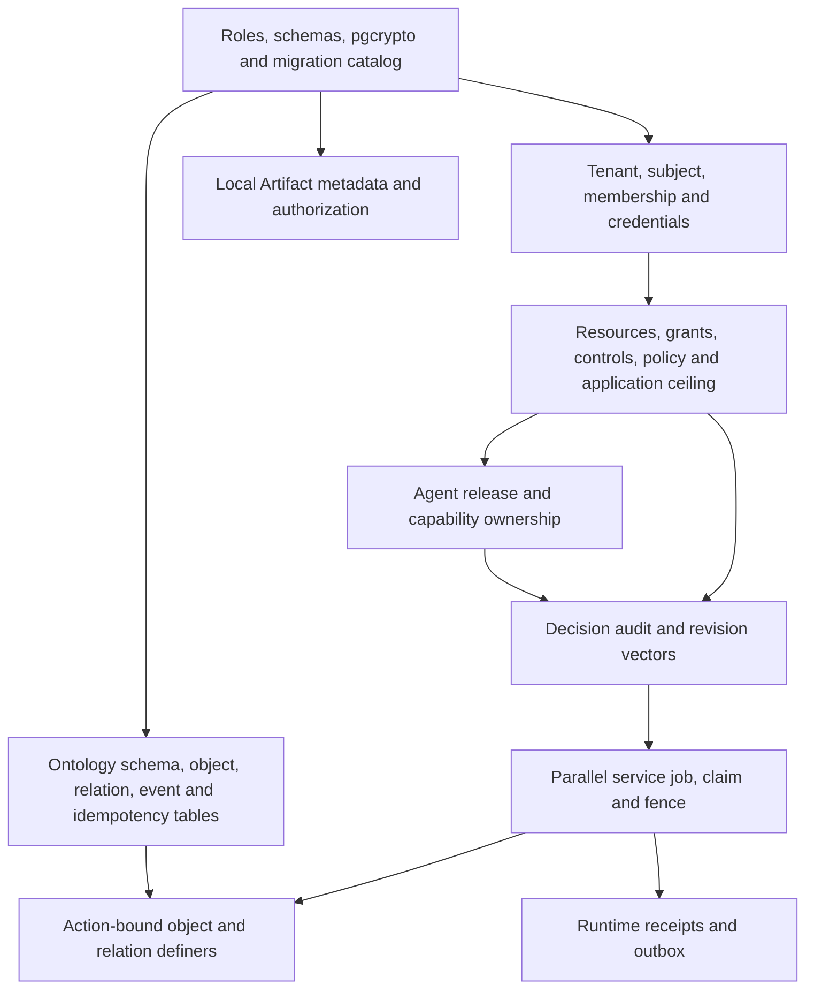

# Migration Catalog audit

Frozen EIOS commit: `1e363db982daeca74058453ad12fc4a6cac333da`.

## Required revision read from executable logic

`eios.adapters.postgres.migrations.load_migrations` scans only top-level package entries matching `^(\d{4})_([a-z][a-z0-9_]*)\.sql$`, rejects duplicate versions, computes SHA-256 from file bytes and sorts by version. It does not recurse into fragments/pending. `apply_migrations` uses an advisory lock, verifies the database history is a continuous catalog prefix with exact checksums and rejects unknown versions. Phased migrations run prepare/validate separately with history recorded only after success. `current_revision` alone computes max(version), so it is not sufficient for application compatibility.

`eios.persistence.revision._expected_rows` additionally compares the entire loaded sequence with EXPECTED_DATABASE_MIGRATIONS, count 332, final version `0332`, final filename `0332_redrive_damping_anchor.sql`, and SHA-256 `018ce7505278db4d41090976b126809346da2755d3c2d7308d263c614cbb5576`. `verify_database_revision` requires the database sequence to equal that exact expected sequence; missing intermediate rows cannot pass. README's 0233 is obsolete. `migration-catalog.json` records all 332 filenames/checksums and conservative domain-coupling decisions.

## Minimal bootstrap dependency graph (new NexLoop lineage)

This is the extraction dependency design, not an already tested SQL bootstrap. The new lineage must not masquerade as original revision 0332.

Candidate origins: 0001 durable schemas/tables; 0004 asynchronous job/lease/outbox; 0007 access; 0019/0026 relation lifecycle/time; 0021/0022 property/security markings; 0030 access directory; 0053 identity; 0056–0062 authoritative governance; 0076/0079 function-only writes; 0152/0159 ceilings and type-level bounds; 0313 API-key parallel path. These are dependency sources to adapt, not an allowlist of SQL files safe to execute verbatim. Later revisions alter exact revision gates and hash-pinned definers. Include all retained behavior's tests before claiming equivalence.

## Mandatory exclusions

The catalog JSON flags SQL with tennis/sports8/easyclub/yundong8/TOS references. 280 of 332 files are conservatively excluded from verbatim bootstrap, including mixed generic/domain migrations. Generic fragments can be extracted only with explicit provenance and dependency review. Filename-only filtering would miss mixed 0062/0159/0167/0313 bodies and revision-gate functions referencing domain workers.

Exclude tennis court/slot/hold/booking/lesson/schedule collectors, projections, seed objects, sport-specific grants, sports8 partitions and collection credentials, EasyClub/Yundong8 connectors, TOS webhook/mirror/sync/alert/effect functions and production origin mappings. In particular 0005 TOS artifact lifecycle is replaced with local Artifact metadata, not copied as a mandatory TOS startup gate. Do not copy original catalog and delete selected rows, disable exact-revision proof, or silently fall back to Memory. A new explicit checksum catalog owns only the extracted new schemas and rejects drift independently.

No SQL was run against any original EIOS database; this audit reads only frozen source.
